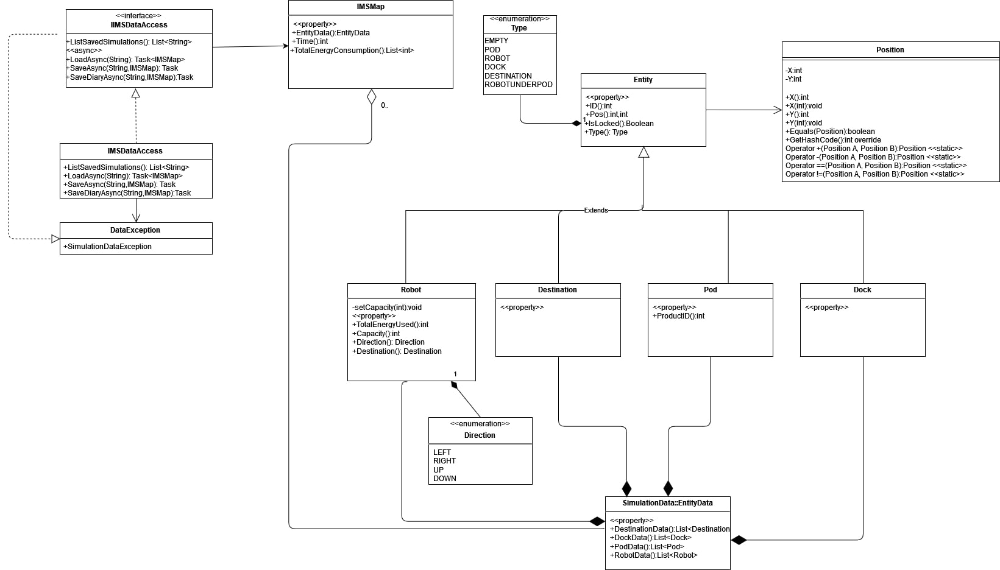

# A szimuláció rövid leírása
A szimulációs program egy raktárban dolgozó szállító robotok útvonalát tervezi meg és hajtja végre a tervet.

A raktár négyzethálóba van szervezve. Vannak benne akkumulátoros robotok (Ri), célállomások (Si),
dokkolónak nevezett töltőállomások (Di), és pod-nak nevezett állványok (P). A robotok
akkumulátorának van egy maximális töltöttségi állapota, ami egy egész szám. Az állványokon termékek
vannak. Egy állványon minden termékszámból legfeljebb egy szerepelhet. A termékszámok a célállomás számok közül kerülnek ki. A robotok feladata, hogy a termékeket az azonos számú célállomásokhoz vigyék (1-es termék az S1 célállomáshoz, 2-es az S2-höz, stb.).

Egy robot úgy tud egy terméket elvinni, hogy az állvány alá áll, megemeli az állványt, majd utána az
állvánnyal együtt mozog. Egy adott számú termék akkor kerül a célállomásra, ha a robot ráállt az
állvánnyal az azonos számú célállomásra, majd a terméket leadja, és ezzel a termék eltűnik az
állványról. A termék (vagy termékek) célállomásra szállítása után a robotoknak az állványt vissza kell
vinniük az eredeti helyükre.

A szimuláció lépésekben történik. Egy központi vezérlő jelöli ki, hogy melyik robot melyik terméket
vigye el a célállomására. Tervezéstől függően, a robotok vagy önállóan dolgoznak, vagy egy központi
vezérlő mondja meg, hogy melyik lépésben milyen műveletet végezzenek. A központi vezérlő és a
robotok is az egész raktár állapotát ismerik. Minden lépésben minden robot végezhet egy műveletet,
ami (a termék leadás műveletét leszámítva) eggyel csökkenti az akkumulátor töltöttségi állapotát.

### A szimuláció indításához meg kell adni:
- a raktár elrendezését (méretek, állványok, célállomások, dokkolók helye)
- robotok száma és helye, maximális töltöttség (tegyük fel, hogy kezdetben minden robot teljesen feltöltött)
- kiszállítandó termékek helye (melyik állványon vannak)
- (esetleg egyéb konfigurációs adatok, amik segíthetik a megoldást)

Az állítható sebességű szimuláció során szeretnénk látni a raktár alaprajzát, a robotok mozgását, a
robotok telítettségi állapotát, a termékeket, az állványokat és mozgásukat.

### A szimuláció végén egy napló fájlban meg akarjuk kapni:
- hány lépésig tartott a teljes feladat végrehajtása,
- minden egyes robotra, hogy összesen mennyi energiát fogyasztott,
- összesen mennyi energia kellett a feladat végrehajtásához.

## Bónusz feladatok
### Input adatok szerkesztése (5 pont): 
- Egy külön szerkesztővel lehet létrehozni a szimuláció indításához szükséges adatokat. A szerkesztett adatok elmenthetők és betölthetők. A raktár szerkesztő lehetővé teszi, hogy kijelöljünk polcokat és együtt áthelyezzük őket. Kijelölt polcokon egyszerre ugyanazokat a termékeket helyezhetjük el. 

### Termékek robotokhoz rendelése kifinomult (5 pont): 
- Optimalizálás történik.

### Útvonal keresés (5 pont): 
- Kifinomultabb algoritmust használ, és a konfliktusok elkerülésére is figyel

# Felhasználói dokumentáció
A program indítása után megjelenik a kezdőoldal, ahol a felhasználónak lehetősége van szimulációt betölteni, vagy létrehozni újat. 

Bal oldalon található a menüsor, az itt található gombok szolgálnak a szimuláció elindítására, betöltésére, mentésére, gyorsítására, lassítására, a beállítás ablak megnyitására, és a szimulációból való kilépésre, mellette a szimuláció táblája látható.

Új szimuláció létrehozása egy külön ablakban történik. Itt a felhasználó megadhatja a szimuláció kezdetén a raktár elrendezését és méretét.
Robotokat, töltőállomásokat, célállomásokat és polcokat vehet fel a felületre, azok tartalmával együtt.

A kezdőoldalon a szimuláció elindítása után a robotok töltöttségi állapota és a polcok tartalma az erre szolgáló felületen egy felugró ablakban megtekinthető, a táblán a mezőkre kattintás után.

# Tervezés
## Felhasználói felület terv
### Főoldal

### Szimuláció létrehozása

## Felhasználói történetek
[Felhasználói történetek](./felhasznaloi-tortenetek.pdf)

## Use case diagram

## UML diagramok
### Package diagram

### Starter class diagram

### Class Model

### Class ViewModel

### Class Persistence
